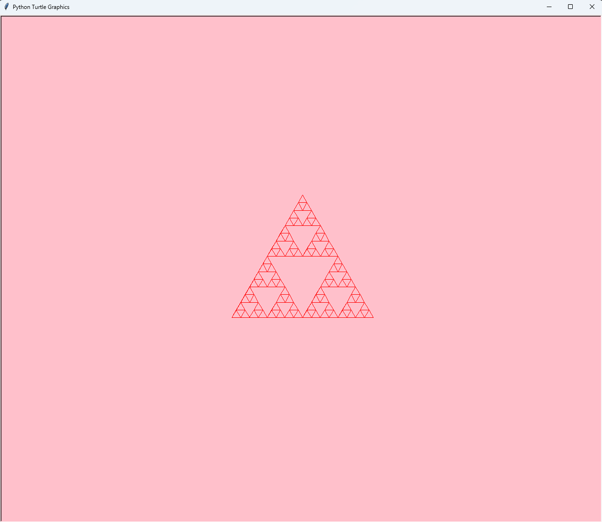

# Fractal Password Generator
***

or goto C:\Users\kensei.higashi\Pictures\Screenshots\Screenshot 2026-03-02 102655.png for the photo of example output

This project makes a sierpenski triangle in any color, and any depth you want (1-5)

# How to use the Project
***
1. Install tkinter so the project won't crash out on you
2. Run the code
3. A page for turtle will pop up, don't delete it, ignore it and go back to the terminal
4. Next, Enter recursion depth (1-10) don't do anything other than 1 through 10 or it won't run the way you want it
5. Pick the triangle color, make sure to type in the color name with no typos
6. Pick the background color

# Contributors
Kensei Higashi